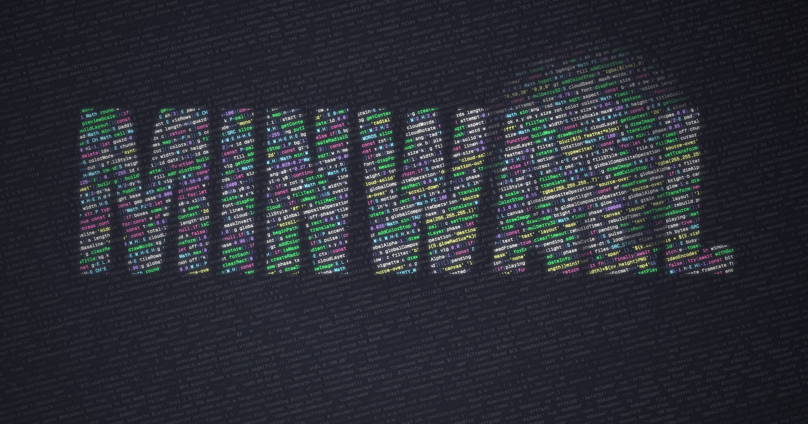
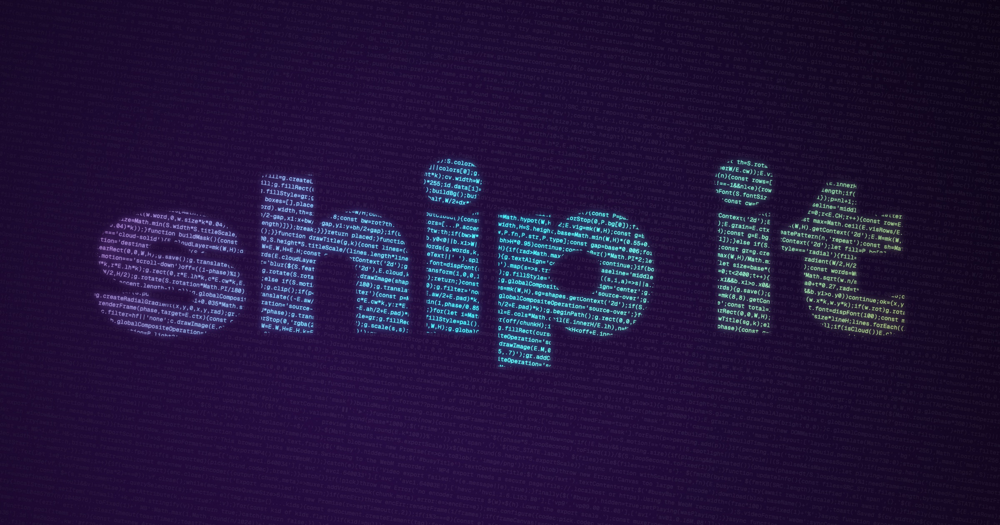

# minwall

Turn any codebase into a wallpaper or a seamless looping video. Point it at a GitHub repo, and it picks the most representative source files, minifies them into a dense wall of syntax-highlighted code, and lets you style, animate and export the result.

**[Open minwall →](https://nickpiscitelli.github.io/minwall/)**



It's one HTML file with no build step and no backend. Everything runs in your browser, including the video encoder.

## What it does

- **Loads code from anywhere.** Paste a GitHub repo (`owner/name`, a repo URL, or a `/tree/branch/folder` URL for a subfolder), drop a local folder onto the page, pick files, or just paste code. Private repos work with a personal access token, which stays in the tab and is never stored.
- **Picks the files for you.** Auto-pick scores every file. It favours the repo's main language and folders like `src/` and `lib/`, and skips vendored code, build output, lockfiles, minified bundles and tests. It fills a size budget you control. Re-roll does a weighted random pick, and you can tick files in or out by hand.
- **Minifies the code.** Comments are stripped per language, and there are three levels: aggressive (no spaces), collapsed whitespace, or raw lines.
- **Overlays.** A title mask where the code fills big display letters (the repo name by default), or a word cloud built from the repo's most common identifiers. The cloud can be a mask or a coloured layer behind the code. Masks can be inverted and feathered.
- **Motion.** Scroll up or down, typewriter, a wandering spotlight, a breathing mask, and hue cycling. Every motion is built to loop with no visible seam.
- **Styling.** Dracula, Rosé Pine, Nord, Synthwave, Phosphor and four more palettes. Ten monospace fonts (Geist Mono by default), rotation, margins, glow, vignette, grain and scanlines.
- **Any size.** Fits your screen live by default, with presets for 4K and 5K, MacBook displays, ultrawides, iPhone, iPad, stories, X and LinkedIn headers, and GitHub social previews.
- **Exports.**
  - PNG at 0.5× to 2×, or copy it to the clipboard.
  - MP4 (H.264, or HEVC/AV1 for very large sizes) is rendered frame by frame with WebCodecs, so it's frame-perfect and usually faster than real time. A 12-second 1080p60 loop takes about 2 seconds.
  - Real-time WebM recording is the fallback.



## Controls

| Key | Action |
| --- | --- |
| `Space` | Play / pause |
| `R` | Surprise me (randomize the look) |
| `P` | Save PNG |
| `V` | Export video |
| `F` | Fullscreen |
| `C` | Show / hide the controls panel |
| `H` | Hide all overlays (`Esc` brings them back) |

The overlays fade away after 3 seconds without input. Saved looks can be exported and imported as `.json`.

## Run it locally

```bash
git clone https://github.com/NickPiscitelli/minwall && cd minwall
python3 -m http.server 8790
```

Then open <http://localhost:8790>. Opening `index.html` directly also works.

MP4 export needs a secure context (`https`, `localhost` or `file://`). From a plain-http LAN address, it falls back to WebM.

## Notes

- Without a token, GitHub allows 60 API requests per hour. Loading a repo costs two of them; file contents come from `raw.githubusercontent.com`, which doesn't count against that limit.
- For very large repos GitHub truncates the file tree. Point minwall at a subfolder URL instead, for example `torvalds/linux/tree/master/kernel/sched`.
- The only dependency is [mp4-muxer](https://github.com/Vanilagy/mp4-muxer), pinned and loaded from jsDelivr.

## License

MIT
